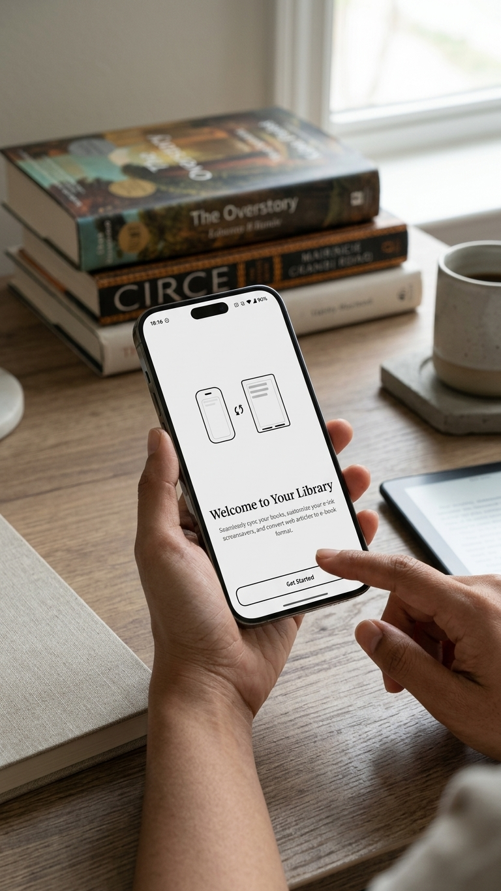
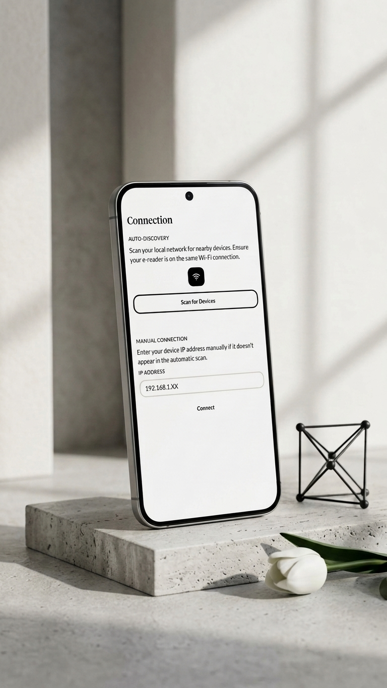
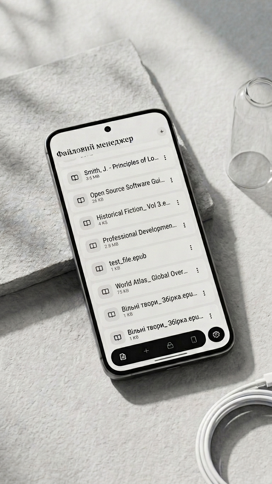
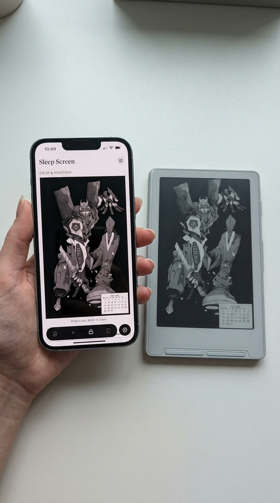

<p align="center">
  
</p>

# Inkcast

## Overview

**Inkcast** is a modern, open-source Kotlin Multiplatform companion app for [**CrossPoint Reader**](https://github.com/crosspoint-reader/crosspoint-reader) — an open-source e-ink reading device. It enables users to connect to their CrossPoint Reader over Wi-Fi, browse and manage files, generate EPUB books from web articles or custom text, and customize the device's sleep screen — all from a single, intuitive interface.

Built with Compose Multiplatform, Inkcast runs natively on both **Android** and **iOS** from a shared codebase. The project is highly modular (28+ independent modules) and follows clean architecture principles, making it easy to extend and contribute to.

Originally developed as a companion app for the CrossPoint Reader project to streamline the e-reader workflow. If you need functionality that isn't currently supported, feel free to open an issue.

## Quick Demo

<p align="center">
  
  
  
  
  
</p>

## Core Features

* **Device Connection:** Discover e-readers on the local network via auto-scan or connect manually by IP address.
* **File Manager:** Browse device directories, upload files, create folders, rename and delete items — all from your phone or tablet.
* **EPUB Generator:** Convert any web article URL or custom text into a properly formatted EPUB and upload it directly to the device.
* **Sleep Screen Editor:** Pick an image, crop it, overlay widgets (calendar, quote), preview the e-ink rendering, and upload as the device's sleep screen.
* **Device Dashboard:** Monitor firmware version, uptime, free RAM, IP, Wi-Fi mode; change screen orientation and interface theme.
* **Multiplatform:** Fully shared UI and business logic across Android and iOS via Compose Multiplatform.

## Functional Capabilities

| Feature                  | Description                                                                                      |
|:-------------------------|:-------------------------------------------------------------------------------------------------|
| **Onboarding Wizard**    | Step-by-step first-launch flow guiding device connection and initial setup.                      |
| **Auto-Discovery**       | Scans the local network for compatible e-reader devices.                                         |
| **File Operations**      | Upload, download, rename, delete files and create folders on the connected device.               |
| **URL-to-EPUB**          | Extracts article content from a URL, builds an EPUB, and uploads it to the device in one tap.    |
| **Text-to-EPUB**         | Paste or type custom text, set a title, generate an EPUB, and send it to the device.             |
| **Sleep Screen Designer**| Crop images, add widget overlays (calendar/quote), preview e-ink rendering, upload to device.    |
| **Device Management**    | View device status, switch orientation/theme, manage multiple devices.                           |
| **Share Intent Support**  | Share a URL from any app — Inkcast intercepts it and offers to generate an EPUB immediately.    |
| **Localization**         | Full support for English, Ukrainian, Spanish, and German.                                        |
| **Theming**              | Light and Dark Material3 themes with dynamic switching.                                          |

## Technical Specifications

| Aspect                    | Details                                                                     |
|:--------------------------|:----------------------------------------------------------------------------|
| **Framework**             | Kotlin Multiplatform + Compose Multiplatform 1.10.2                         |
| **UI Toolkit**            | Material3, Atomic Design (atoms, molecules, organisms)                      |
| **State Management**      | Orbit MVI 11.0.0 (State / Intent / SideEffect)                             |
| **Dependency Injection**  | Koin 4.1.1                                                                  |
| **Networking**            | Ktor 3.1.3 (OkHttp on Android, Darwin on iOS, WebSockets)                  |
| **Local Storage**         | CouchbaseLite (KotBase) 3.2.4, DataStore Preferences, multiplatform-settings|
| **Serialization**         | kotlinx-serialization 1.6.0 (JSON)                                         |
| **Navigation**            | AndroidX Navigation Compose 2.9.2                                           |
| **Concurrency**           | kotlinx-coroutines 1.9.0, AtomicFU                                         |
| **Build System**          | Gradle 9.1.0 with Convention Plugins for centralized build logic            |
| **Toolchain**             | Kotlin 2.3.20, JVM target 21                                               |

## Architecture

Inkcast follows a **multi-module Clean Architecture** approach:

```
┌─────────────────────────────────────────────────┐
│                compose-application              │  ← App entry point
├──────────────┬──────────────┬───────────────────┤
│ presentation │  presentation│   presentation    │
│ feature-*    │  core-*      │   core-ui         │  ← UI layer (MVI)
├──────────────┴──────────────┴───────────────────┤
│              domain (core / api)                │  ← Business logic
├─────────────────────────────────────────────────┤
│         data (network / preference / repo)      │  ← Data layer
├─────────────────────────────────────────────────┤
│               build-logic/convention            │  ← Gradle plugins
└─────────────────────────────────────────────────┘
```

**Module breakdown:**
- **`compose-application`** — KMP application entry point; wires all layers together
- **`presentation-feature-*`** (10 modules) — Feature screens (splash, onboarding, connection, home tabs, settings, about)
- **`presentation-core-*`** (5 modules) — Shared UI kit, theming, navigation, localization, platform utilities
- **`domain-*`** (4 modules) — Core models, repository interfaces, use case contracts & implementations
- **`data-*`** (5 modules) — Network clients, preferences, repository implementations
- **`build-logic/convention`** — 4 Gradle convention plugins (application, feature, library, di)

## Installation & Deployment

### Prerequisites

* Android Studio Ladybug or newer (for Android)
* Xcode 16+ (for iOS)
* JDK 21
* Android device or emulator (API 27+)
* iOS device or simulator

### Build Instructions

```bash
# Clone the repository
git clone https://github.com/andrew-malitchuk/inkcast-kmp.git

# Build Android debug APK
./gradlew :composeApp:assembleDebug

# Build iOS framework
./gradlew :composeApp:linkDebugFrameworkIosArm64

# Run all checks
./gradlew check

# Clean build
./gradlew clean
```

For iOS, open the `ios-application/` directory in Xcode and run from there.

### Setup

1. Install the app on your device.
2. Complete the onboarding wizard.
3. Connect to your e-reader via auto-discovery or manual IP entry.
4. Start managing files, creating EPUBs, and customizing your sleep screen.

## Roadmap

- [ ] Batch file operations
- [ ] Desktop (JVM) target support

## Feedback & Feature Requests

If you have ideas for new features or encounter issues, please open an issue in the repository. This project started as a personal tool — if you need functionality that isn't currently supported, let's discuss it in the Issues section.

## Troubleshooting

| Problem                         | Solution                                                                 |
|:--------------------------------|:-------------------------------------------------------------------------|
| Device not found during scan    | Ensure both devices are on the same Wi-Fi network. Try manual IP entry.  |
| EPUB upload fails               | Verify the device is reachable. Check available storage on the e-reader. |
| iOS build fails                 | Run `./gradlew :composeApp:linkDebugFrameworkIosArm64` before Xcode build.|
| Gradle sync issues              | Ensure JDK 21 is configured. Run `./gradlew clean` and re-sync.         |

If you still need assistance, feel free to open an issue.

## Contributing

Contributions are welcome. Please follow the standard pull request process:

1. Fork the repository.
2. Create a feature branch.
3. Submit a PR with a detailed description of changes.

This project started as a personal tool to cover my specific use cases. If you need functionality that isn't currently supported, let's discuss it in the Issues section before submitting a PR.

---

Built with Kotlin Multiplatform, Compose Multiplatform, Koin, and Orbit MVI.

## License

Apache 2.0 License

```
Copyright (c) [2026] [Andrew Malitchuk]

Licensed under the Apache License, Version 2.0 (the "License");
you may not use this file except in compliance with the License.
You may obtain a copy of the License at

    http://www.apache.org/licenses/LICENSE-2.0

Unless required by applicable law or agreed to in writing, software
distributed under the License is distributed on an "AS IS" BASIS,
WITHOUT WARRANTIES OR CONDITIONS OF ANY KIND, either express or implied.
See the License for the specific language governing permissions and
limitations under the License.
```
